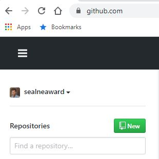
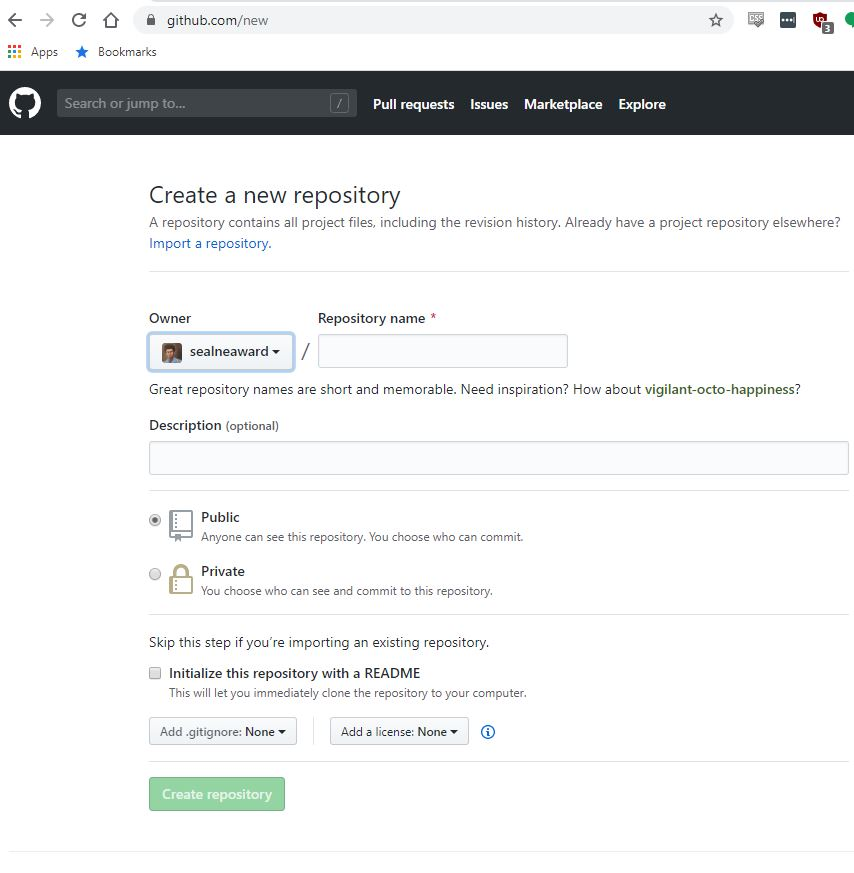
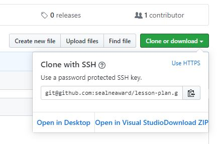

# git

Every single person that learns how to code should learn how to use git, which is a version control software that makes tracking code changes really easy and also enables you to have a public portfolio to showcase your coding skills.

### Setup

1. Setup your github.com account.

2. Setup your account with [ssh keys](https://help.github.com/en/github/authenticating-to-github/generating-a-new-ssh-key-and-adding-it-to-the-ssh-agent). I can help you with this step.

### Create a Project

After you setup your github account with ssh-keys, you can now create a private project, that can later become public. Without ssh-keys, you cannot work on private projects.

1. Login to github.com and create a project.



2. Enter the preferred setting of project.

- Don't include spaces in the name of the project. Either use spaces or underlines between words.
- It's best to use lowercase characters in the name as well.
- Make the project private.
- Add a simple one sentence description.
- Enable the project with a README. This file can be edited later, but it's best to start with a non-empty repository.



3. Finish by pushing the Create repository button.

### Cloning

Cloning is the act of `downloading` a repository. I say it with italics, as you can download a repository as a zip file, but it does not contain the necessary information in order for git to track it and it is a bad habit to form when using git.

Cloning is the first step of working on an existing project.
If you are starting a new project, you will want to create it first (see previous).

1. Copy the SSH url of the project.



2. Open your preferred terminal, and run this command, substituting the `${git_url}` variable with your ssh url you just copied.

```
git clone ${git_url}
```

3. If this is the first time cloning a repository, you might get a confirmation prompt, say yes[y] for whatever confirmation prompt comes up.

Congradulations, you now have a cloned repository.

### Making Changes

Git is best used when you work on branches.
This makes sure that any code you work on is tracked seperately from the main master branch, and can undergo review before merging the code into master.

1. Checkout a feature branch before making code changes. Substitute the  `${branch_name}` variable with your preferred branch name. Use something that is descriptive of the work you are about to do.

```
git checkout -b ${branch_name}
```

2. Make code changes. This can be as simple as changing your `README.md` file.

3. Now get git to track the changes. To see which files have been changed inside the repository, you can view the status of your repository.

```
git status
```

4. With viewing the status, you can pick and choose which files to add, or add all the changes for a commit.

```
git add ${file_1} ${file_2}
```

```
git add --all
```

5. Now make a commit message once you are satisfied with the changes you made.

```
git commit -m 'Message describing your changes go here'
```

6. Now you can push your changes to your feature branch. Remember to substitute the `${branch_name}` variable with the one your use in checkout earlier.

```
git push origin ${branch_name}
```

### Merge Branch

Now that your changes are in a branch, they are not in master yet, you can merge these changes through the github UI.

1. Open a Pull Request
