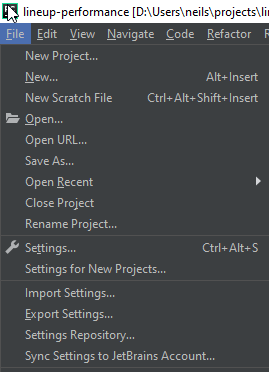
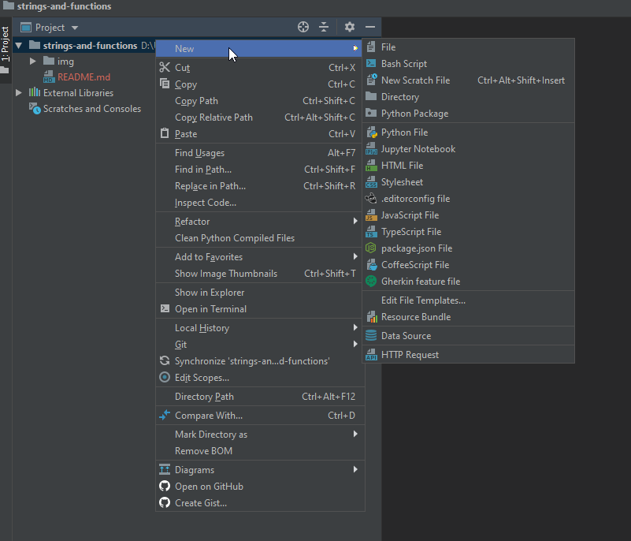
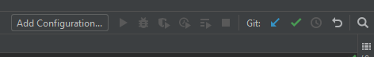
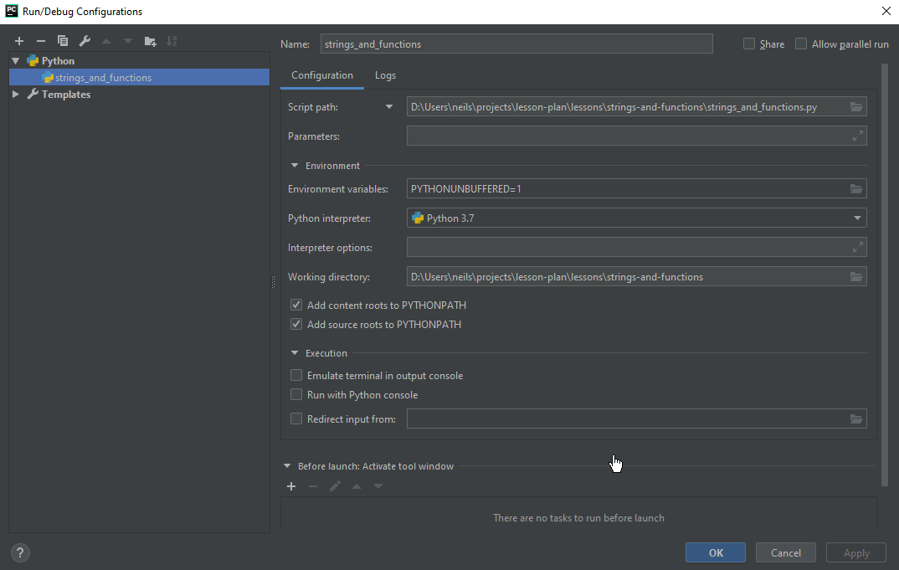
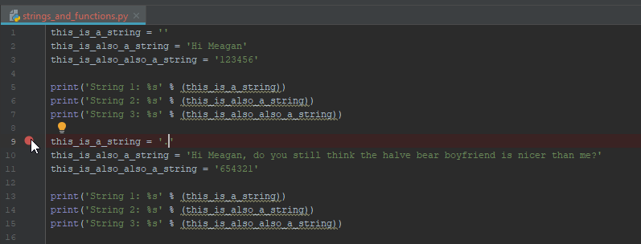
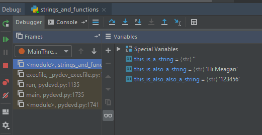
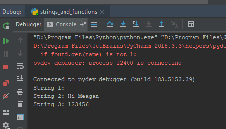
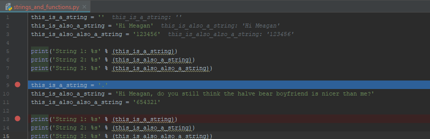
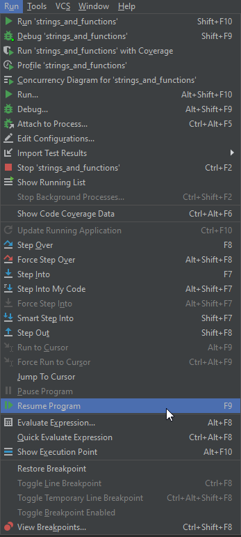

# Python

Python is an excellent language to first learn when being introduced to programming. The syntax is simple and understand, but is very powerful in the possible operations and is one of the most needed skills in the workforce. There are many jobs that require Python to analyze and manipulate data, such as: health administrative analysts, office administrative employees, data analysts, etc. Python is also a decent language for introductions into web servers and other areas of computer science. For the purposes of the next lessons in Python, all problems will be posed in the realm of office administration and human resources.

### Setup

1. Ensure Python is installed. Open your preferred terminal and see if this command will return anything. If you get an error, you probably do not have Python installed on your machine.

```
python --version
```

2. Install PyCharm.

3. Create a new project in git for this lesson. Clone it to a location that you will remember later.

### Packages

Python is an excellent language, but it would be nothing without its packages. Python packages are at the core why this language is so popular. Packages are extremely easy to make and maintain, as well as installing.

Python packages are maintained by pip, which in itself is a Python package.

1. Check to see if you have pip installed.

```
pip --version
```

2. If you do not have pip installed, you can install it through your preferred terminal. Skip this if you have it installed.

```
curl https://bootstrap.pypa.io/get-pip.py -o get-pip.py
```

```
python get-pip.py
```

3. Install your first pip package. This `virtualenv` package is what we are going to use later to manage reproducibility in our repositories and manage packages for continuous integration.

```
pip install virtualenv
```

### Scripts

Scripts are the stand-alone operations that would exist in a single `.py` script that do not have any external dependencies. In a script, we are going to do some simple string manipulation and output.

#### Strings

In programming, we have objects that represent different types of data, each of which can be interpreted differently, dependent on their characteristics.

- **Integers**: Integers(ints) are objects that contain numerical data
- **Characters**: Characters(chars) are objects that contain a single letter, special letters, punctation, numbers, etc.
- **Strings**: Strings(strs) are objects that contain a single character, or more than one characters in succession.
- **Arrays**: Arrays(arrs): are objects that contain a range of a single object type, often denoted in a format to indicate multiple objects inside of brackets. Ex/ [...]. An example of an array can actually be a String because Strings can be interpreted as an array of Characters.

1. Open up PyCharm and go to `File > Open`



2. Remember the location of your cloned project and open a project in that exaction location. If not, you will be coding in a directory that is not being tracked by your git project.

3. Once your new/existing project is created in PyCharm, you can create a new Python script. Right click your project folder, go to `New > Python File`.



4. Make sure to provide a name without `-` or ` ` spaces in the name. Use `_` underscores if you want to seperate words. After creation, PyCharm may ask you if you want to add this script to your git repository, either answer is fine, as you will still have to perform manual git operations later in your preferred terminal to commit the changes to your repository.


5. Create a debugging configuration. Make sure you have the interpreter pointing to a valid Python installation. PyCharm should do this by default. If you can't figure this out, let me know, I can help.





6. Add this code to your new script

```py
this_is_a_string = ''
this_is_also_a_string = 'Hi Meagan'
this_is_also_also_a_string = '123456'

print('String 1: %s' % (this_is_a_string))
print('String 2: %s' % (this_is_also_a_string))
print('String 3: %s' % (this_is_also_also_a_string))

this_is_a_string = '.'
this_is_also_a_string = 'Hi Meagan, do you still think the half bear boyfriend is nicer than me?'
this_is_also_also_a_string = '654321'

print('String 1: %s' % (this_is_a_string))
print('String 2: %s' % (this_is_also_a_string))
print('String 3: %s' % (this_is_also_also_a_string))
```

7. Set a breakpoint by clicking to the side of the script in PyCharm. This is for debugging mode in PyCharm. You can stop the script from running at certain points and inspect what is contained in variables at different lines of the script.



8. Run the script in debugging mode.


9. Inspect the Debugger that pops up. You can now see the different variable values at your breakpoint. You can also view the current output by clicking on the Console tab.





10. Add another breakpoint in the script. You can do this while you are still stopped at the first breakpoint.



11. You can fast-forward to the next breakpoint by resuming the program. You can do this by clicking `Run > Resume Program` or hitting F9.



12. You can now see how the same variables have changed throughout the script.

#### Functions

Functions are the moving parts of packages and scripts. They enable you to repeat complex operations without repeating the same code in your script.
Each function is uniquely defined and depend on function arguments and outputs. Arguments are the input for functions. Function do not need to have arguments, as is the same for outputs.
You already used the `print` function in the previous script.

Think of a function as popping bread into a toaster and letting it cook into toast.
The `toaster` function depends on the `bread` argument and will output the `toast` variable.
If you don't provide the `toaster` function with bread, then no output will be produced.
There are other arguments you can provide to the toaster function like time and bagel, but for now, lets keep it simple.

1. In your existing project, create a new Python script, call it `toaster_function` or something like that. Add a debugging configuration to the new script.

2. Add this code to the script.

```py
def toaster(bread):
    return toast

toaster(bread)
```

3. Try running the script. You will receive an error. That is because both the `bread` and the `toast` variables are undefined.

4. Edit the script and add this to it.

```py
def toaster(bread):
    toast = bread
    return toast

bread = 'white'
toast = toaster(bread)
print('Toast type: %s' % (toast))
```

5. Run the script, you will see no errors.

#### Logic Comparisons

Logic comparisons are something you do everyday as a human. You evaluate different circumstance you are in and produce a choice based on them.
Each time you have grumbles in your stomach, your brain evaluates that condition and produces the action of getting food and eating.
You brain evaluates that `hungry = True` and produces the eat action.
In programming, this is how we evaluate different variables to produce different actions.

There are many ways to evaluate variables in Python, but for now, the simple ones that you need to understand are these:

- `==` **equals to**: only set to True if both sides of the comparison are the exact same in value, otherwise False.
- `!=` **not equals to**: only set to True if one side of the comparison is not the same as the other side, otherwise False.
- `>` **greater than**: numerical comparison only, set to True if Left Side is greater numerically than the right side, otherwise False.
- `<` **less than**: numerical comparison only, set to True if Left Side is lesser numerically than the right side, otherwise False.

You can have different combinations of these symbols and there are functions that do comparisons as well, but for now, we will use only these.

Along side the comparisons, there are conditional outcomes that evaluate the comparisons.

- `if` **if**: if condition is evaluated to true, then proceed
- `elif` **else if**: if the first `if` condition is evaluated to False, then find out if this secondary condition is True, then proceed if True
- `else` **else**: if the first `if` and any proceeding `elif` conditions are evaluated to valse, always proceed to the following operations

Lets add some childish bias to our toaster.
As a kid, I hated brown toast, but that was the only type of toast that my mom let me eat.

1. Lets change the `toaster` function to incorporate my moms logic.

```py
def toaster(bread):
  toast = None
  if toast == 'white':
    print('You are not allowed to eat this Neil')
  elif toast == 'brown':
    print('Good decision Neil')
  else:
    print('What are you putting in the toaster? What is wrong with you?')
  return toast

bread = 'white'
toast = toaster(bread)
print('Toast type: %s' % (toast))
```

2. Play around with the bread type to see the different responses. You can also edit the comparisons as well.
